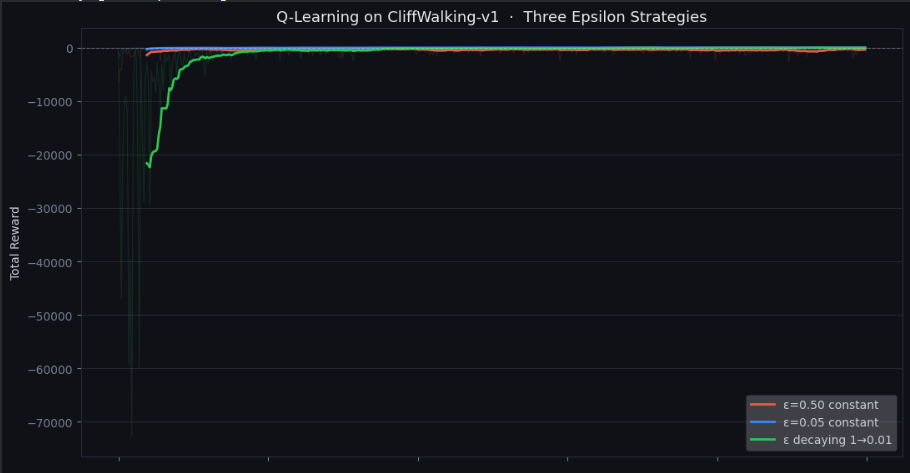

# Analysis Report

This is the plot generated:

Here the faded lines represent the actual plot of sum of rewars over each episodes.

The bold line represents a moving average over 20 values that helps to visualise the learning pattern by smoothening out the graph

1. The agent with least EPSILON (i.e, e = 0.05) learns the safe path fastest as it exploits most of the times instead of    exploring. But the downside to this is that this agent clings to the first safe route it encounters, it is safe but might not be the most optimal.
2. The decaying EPSILON agent learns the optimal path in the long run. It keeps on exploring even when it has found a safe path. This leads it into finding the most optimal one.
